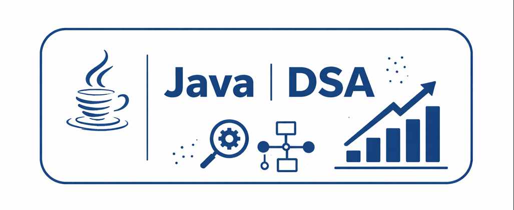

# Java Data Structures and Algos 
### leetocode and extra problems for mastering DSA

``Java programs for learning fundamental concepts and algorithms.``

## What's Inside

**Arrays** - ArrayList and array operations  
**String** - String manipulation and problems  
**Linked Lists** - Linked Lists manipulation and problems  
**sorting_algos** - Sorting and searching algorithms  
**BinarySearch** - Binary search problems (e.g. Find Peak Element - LeetCode 162)  
**BitManipulation** - Bit manipulation techniques  
**Maths** - Math-based problems  
**Recursion** - Recursion and subsequence patterns  
**extra problems** - Additional practice problems


## Fun Projects
```java

public class miniProjects{
    public void musicPlayer{
        // music player using linkedlists whole basket of things . 
    }
}
```